<h3><code>fatima@github ~ $ whoami</code></h3>

<h1>Hi, I'm Fatima Sohail 👋</h1>

<h3>Data Science Student · Machine Learning · Full-Stack Development</h3>

Exploring data, understanding models, and building practical applications.

  

---

## 🎯 About Me

I'm **Fatima Sohail**, a **BS Data Science student** interested in machine learning, data analytics, and full-stack development.

My projects range from implementing machine learning algorithms from scratch to analyzing large datasets with Spark and building interactive applications. I enjoy understanding what happens behind a model's predictions and presenting the results clearly.

- 🧠 **Machine learning:** classification, clustering, feature engineering, and model evaluation.
- 📊 **Data analytics:** cleaning datasets, exploring patterns, and creating visualizations.
- 🔬 **Research projects:** medical image classification and motor fault diagnosis.
- 💻 **Application development:** interactive R Shiny tools and web projects.
- 🤝 **Open to:** internships, collaborative projects, and opportunities to apply my skills.

---

## 🛠️ Technical Toolkit

 

<b>📚 Languages, Libraries & Tools</b>

 

| Area | Technologies |
| :--- | :--- |
| **Programming** | Python · R · SQL · C++ · Java · JavaScript |
| **Data Analysis** | Pandas · NumPy · Matplotlib · Seaborn · ggplot2 · dplyr |
| **Machine Learning** | Scikit-learn · Classification · Clustering · PCA · Feature Engineering |
| **Deep Learning Projects** | EfficientNet · Graph Attention Networks · Grad-CAM |
| **Big Data & Databases** | Apache Spark · Hadoop · PostgreSQL · Data Warehousing |
| **Web & Interactive Apps** | React · HTML · CSS · Bootstrap · R Shiny |
| **Parallel Computing** | OpenMP · CUDA · CPU–GPU Computing |
| **Development Tools** | Git · GitHub · Jupyter Notebook · VS Code · Docker |

---

## 🚀 Featured Projects

### ⚙️ Motor Fault Diagnosis using Machine Learning

Studying motor health through electrical current signatures, with **from-scratch implementations** of K-NN, PCA, Logistic Regression, Naive Bayes, and SVM.

The project explores binary and multiclass classification, dimensionality reduction, and class-level performance.

**Focus:** `Machine Learning` `Signal Data` `Model Evaluation`

[**View repository →**](https://github.com/FatimaSohailCheema19/Motor-Fault-Diagnosis-Machine-Learning)

---

### 🔬 Cervical Cytology Classification

A research implementation combining **EfficientNet-B0**, a **Region-Graph Attention Network**, and a **Fuzzy Confidence Head** for five-class cervical cell classification.

Includes cross-validation, interpretability, and ablation experiments.

**Focus:** `Deep Learning` `Computer Vision` `Research`

[**View repository →**](https://github.com/FatimaSohailCheema19/EfficientNet-GAT-Fuzzy-Cervical-Cytology)

---

### 🚕 NYC Taxi Trip Analytics

Analysis of **2.96 million taxi-trip records** using Apache Spark in local mode, covering data cleaning, transformations, SQL queries, window functions, and caching experiments.

**Focus:** `Apache Spark` `SQL` `Big Data Analytics`

[**View repository →**](https://github.com/FatimaSohailCheema19/NYC-Taxi-Trip-Analytics-Apache-Spark)

---

### 🛒 Pakistan E-commerce Customer Segmentation

Customer segmentation using **RFM analysis and K-Means clustering**, with preprocessing, feature scaling, and cluster evaluation.

Explores purchasing behavior to distinguish customer groups.

**Focus:** `Customer Analytics` `Feature Engineering` `Clustering`

[**View repository →**](https://github.com/FatimaSohailCheema19/Pakistan-Ecommerce-Customer-Segmentation)

---

### ⚡ Hybrid Parallel Fraud Detection

A K-NN workload comparing **serial CPU, OpenMP, CUDA, and hybrid CPU–GPU implementations** on 500,000 synthetic transactions.

The controlled K = 5 experiment recorded **17.84× compute speedup** and approximately **2.17× end-to-end speedup** for the hybrid implementation.

**Focus:** `C++` `OpenMP` `CUDA` `Performance Analysis`

[**View repository →**](https://github.com/FatimaSohailCheema19/Hybrid-Parallel-Fraud-Detection)

---

<b>📂 More Projects — Applications, Analytics & Data Systems</b>

 

| Project | Description |
| :--- | :--- |
| [**R Shiny Data Cleaning App**](https://github.com/FatimaSohailCheema19/RShiny_DataCleaning_App) | CSV upload, data-cleaning controls, previews, and cleaned-data export. |
| [**Movie Data Visualizer**](https://github.com/FatimaSohailCheema19/RShiny_Movies_Visualizer) | Interactive scatter plots with variable selection and customizable plot controls. |
| [**Pakistan E-commerce Visualization**](https://github.com/FatimaSohailCheema19/Pakistan-Ecommerce-Data-Visualization) | Exploratory analysis and visualizations using Python. |
| [**MediScan AI**](https://github.com/FatimaSohailCheema19/mediscan-ai) | A medical scan classification web application project. |
| [**RescueSync**](https://github.com/FatimaSohailCheema19/RescueSync-Emergency-Response-Platform) | An emergency response platform with web and mobile applications. |
| [**Tour Management Data Warehouse**](https://github.com/FatimaSohailCheema19/Tour-Management-Data-Warehouse) | PostgreSQL data warehouse design with dimensional schemas. |
| [**Pizza Accessibility Analysis**](https://github.com/FatimaSohailCheema19/Pizza-Accessibility-Spatial-Analysis-QGIS) | Spatial accessibility analysis using QGIS. |

---

## 📊 GitHub Analytics

  

  

Language statistics describe repository contents, not proficiency levels.

---

## 🟩 Contribution Calendar

  

Each square represents a day. Green intensity reflects contribution activity.

---

## 📈 Activity Over Time

---

## 🎓 Learning & Growth

I'm continuing to develop my understanding of:

- **Model evaluation:** looking beyond accuracy to understand errors and class-level performance.
- **Deep learning:** exploring image classification and model interpretability.
- **Data engineering:** working with Spark, SQL, and data warehouse design.
- **Application development:** connecting analytical work with useful interfaces.
- **Performance:** understanding the trade-offs between CPU, GPU, and hybrid execution.

---

## 🤝 Open to Opportunities

I'm interested in **data science and machine learning internships**, **analytics projects**, and **web development collaborations**.

If you're working on something related, I'd be happy to connect.

### 📫 Connect With Me

  

**Thanks for exploring my work.**

