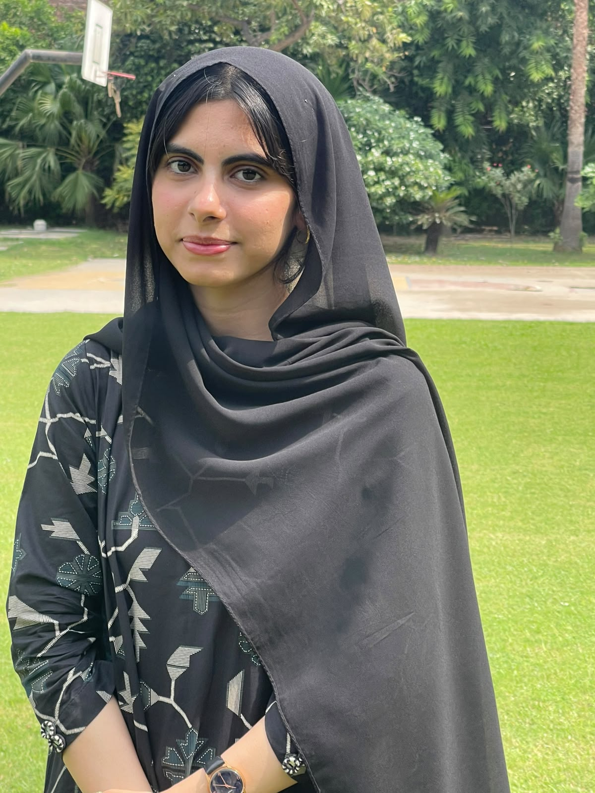

 

  

<h3>Data Science Student · Python & R · Data Visualization</h3>

Turning raw data into clear insights, thoughtful visualizations, 
and interactive applications.

 

  

<code>curiosity → exploration → understanding → creation</code>

  

---

### `~/whoami`

I'm **Fatima Sohail**, a **BS Data Science student** interested in understanding data and building projects that make it easier to explore.

- 📊 My work includes **data cleaning, exploratory analysis, and visualization**.
- 🐍 I use **Python and Jupyter notebooks** for data-focused projects.
- 📈 I build interactive applications with **R, Shiny, and ggplot2**.
- 🧠 I'm developing my understanding of **machine learning and statistical analysis**.
- 🌱 This profile brings together my academic work, experiments, and learning journey.

 

### `~/toolkit`

  

 

### `~/selected-work`

| Project | What I explored | Tools |
| :--- | :--- | :--- |
| **🛒 Pakistan E-commerce Analysis** | Data cleaning, exploratory analysis, and statistical findings from Pakistan's e-commerce data. | Python · Jupyter |
| **🎬 Movie Browser App** | An interactive movie explorer with selectable axes, categorical color grouping, and adjustable point size and transparency. | R · Shiny · ggplot2 · dplyr |
| **🧹 Data Cleaning App** | A Shiny application focused on working with and cleaning data through an interactive interface. | R · Shiny |
| **🧠 Machine Learning Coursework** | Assignment notebooks and reports documenting my machine learning practice. | Python · Jupyter |

  <a href="https://github.com/FatimaSohailCheema19?tab=repositories"><b>Explore my repositories →</b></a>

 

### `~/learning-log`

> Building my understanding one dataset, one notebook, and one project at a time.

- **Data preparation** — making datasets ready for meaningful analysis.
- **Exploratory analysis** — asking questions and investigating patterns.
- **Machine learning** — connecting theoretical concepts with practical work.
- **Interactive visualization** — helping people explore data for themselves.
- **Documentation** — explaining the process behind each project.

 

### `~/github-stats`

 

### `~/contribution-graph`

---

 

<code>Learning with purpose. Building with curiosity.</code>

  

<b>Thanks for visiting my little corner of GitHub.</b>

  

<a href="https://github.com/FatimaSohailCheema19?tab=repositories">Projects</a>
&nbsp; · &nbsp;
<a href="https://github.com/FatimaSohailCheema19">GitHub</a>

  

